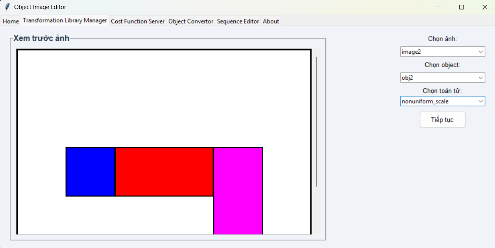
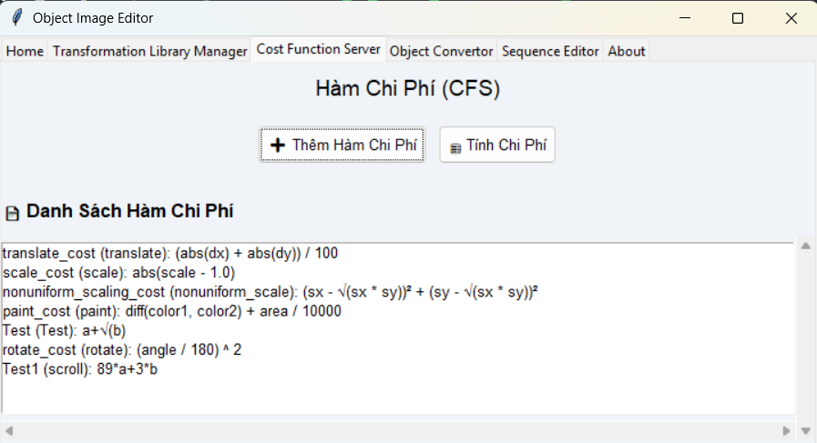
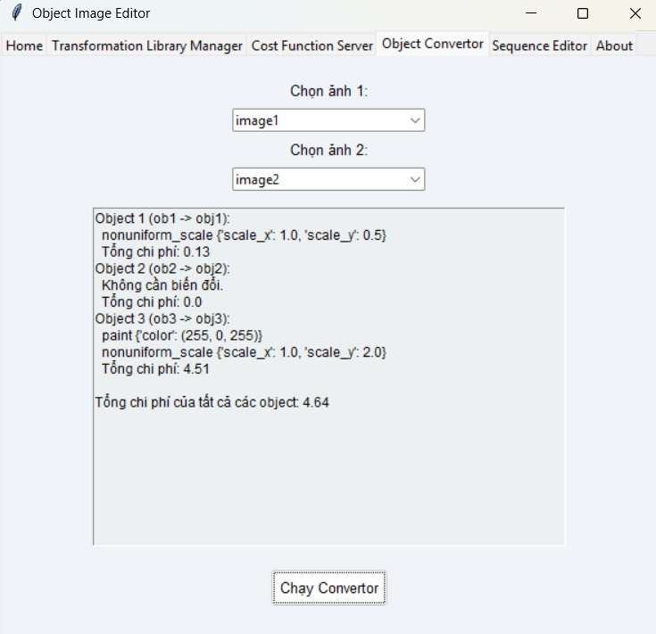
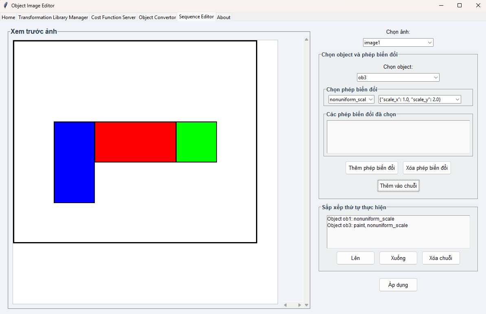
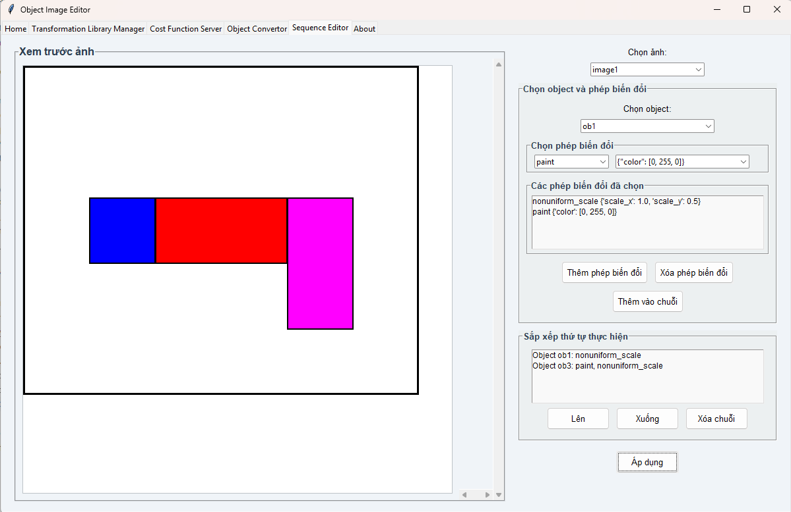

# 💻 Project: Object Image Editor

## 👨‍🎓 Thông tin sinh viên thực hiện
| STT | Họ và Tên               | MSSV        | Tính năng thực hiện                                                               |
|-----|-------------------------|-------------|-------------------------------------------------------------------------------------|
| 1   | Trần Huỳnh Trung Hiếu   | N21DCCN122  | Phát triển file `cost_function_server.py`, thực hiện chỉnh sửa giao diện người dùng và viết tài liệu hướng dẫn sử dụng phần mềm. |
| 2   | Nguyễn Thị Thanh Huyến  | N21DCCN130  | Phát triển file `object_manager.py`, `transformation_manager.py` và viết file README.         |
| 3   | Nguyễn Thị Huyền My     | N21DCCN147  | Phát triển file `object_manager.py`, `transformation_manager.py` và `object_converter`.py. |
| 4   | Tô Phan Kiều Thương     | N21DCCN184  | Phát triển file `cost_function_server.py` và chỉnh sửa tài liệu.     |


## 📘 Thông tin đề bài
As a project, develop a software package that implements the transform-ation-based approach to retrieval by similarity. In particular, your package must contain the following capabilities that can be encoded as functions:

(a) Develop a syntax in which transformation operators can be represented. Then develop a program, called TransformationLibraryManager, that takes as input, perhaps through a user interface or from a file, a transformation operator specified in your syntax, and appends it to the library through a TLMinsert routine. Similarly, write a TLMsearch routine that, given the name of an instantiated operator, will return an appropriately instantiated version of the operator.

(b) Develop a syntax in which cost functions can be represented. Then write a program, called CostFunctionServer, that has a Costinsert routine that takes as input, perhaps through a user interface or from a file, a cost function specified in your syntax, and appends it to a library of cost functions. CostFunctionServer must also have a function, called EvaluateCall, that takes an instantiated transformation operator as input and returns the cost of this operator as output, using the cost functions represented using your syntax.

(c) Develop a program, called ObjectConvertor, that takes two objects o1 and o2 as input and that uses TransformationLibraryManager and CostFunctionServer to construct a least-cost transformation sequence between o1 and o2.

(d) Demonstrate your system's operation using the simple example of transformation sequences in Figure below. In particular, specify all the operations for this example in your syntax, as well as all the cost functions.

## 📝 Mô tả chi tiết bài đã làm
Chương trình được xây dựng bằng ngôn ngữ **Python**, là một ứng dụng có giao diện đồ họa (GUI) sử dụng thư viện **Tkinter**. Khi chạy chương trình, giao diện chính sẽ hiển thị với nhiều tab chức năng, cho phép người dùng thực hiện các thao tác khác nhau như: nhập dữ liệu, áp dụng các phép biến đổi, tính chi phí, xem trình tự xử lý, và xem thông tin giới thiệu.
Chương trình bao gồm các phần sau:
- `main.py` - File chính để chạy chương trình.
- `data/` - Thư mục chứa các file json lưu trữ các phép biến đổi và công thức tính chi phí.
- `tab/` - Thư mục chứa các tab giao diện của ứng dụng như Home, Cost Function Server, Object Converter, Senquence, Transformation Library Manager, About.
- `test/` - Thư mục chứa các file test trong quá trình làm ứng dụng.
- `cost_function_server.py` - Quản lý và tính toán các hàm chi phí dựa trên công thức lưu trữ trong JSON. Hỗ trợ thêm công thức mới, tính chi phí cho các phép biến đổi, và xử lý dữ liệu màu RGB.
    - Chi tiết:
        - Lưu trữ và quản lý hàm chi phí: Các hàm chi phí được lưu dưới dạng JSON trong file data/cost_function.json. Mỗi hàm bao gồm tên (name), loại (type) và công thức (formula) để tính toán.
        - Thêm hàm chi phí mới: Hàm CostInsert() cho phép thêm công thức mới vào thư viện nếu chưa có tên hoặc loại trùng lặp.
        - Tính toán chi phí phép biến đổi: Hàm EvaluateCall() dùng để tính chi phí của một phép biến đổi dựa trên công thức đã lưu, với hỗ trợ các hàm như sqrt, abs, cbrt, fourthrt, rgb_to_val, v.v.
        - Tiện ích xử lý màu RGB: Hỗ trợ chuyển đổi màu về giá trị sáng (brightness) thông qua rgb_to_val().
        Kiểm tra an toàn công thức: Trước khi thực thi eval, chương trình kiểm tra biến đầu vào đầy đủ để tránh lỗi.

- `transformation_manager.py` - Quản lý thư viện các phép biến đổi hình học và thuộc tính đối tượng (như dịch chuyển, co giãn, tô màu). Áp dụng phép biến đổi lên đối tượng, kiểm tra kiểu dữ liệu tham số, lưu/đọc lịch sử sử dụng các phép biến đổi từ tệp JSON.
    - Chi tiết:
        - Lưu trữ thư viện phép biến đổi: Các phép biến đổi được định nghĩa bằng class TransformationOperator, bao gồm tên (name), danh sách tham số (parameters) và hàm áp dụng (apply_function). Các phép này được lưu trữ trong file JSON data/transformations.json.
        - Thêm phép biến đổi mới: Hàm TLMinsert() của lớp TransformationLibraryManager cho phép thêm phép biến đổi mới vào thư viện. Nếu tên đã tồn tại, chương trình sẽ báo lỗi để tránh ghi đè.
        - Tra cứu và khởi tạo phép biến đổi: Hàm TLMsearch() cho phép tìm kiếm và khởi tạo một phép biến đổi với tham số cụ thể. Hệ thống tự động kiểm tra kiểu dữ liệu, độ dài tuple và hỗ trợ chuyển đổi từ list → tuple nếu cần.
        - Áp dụng phép biến đổi: Mỗi phép biến đổi được thực thi thông qua phương thức .apply() trong class InstantiatedOperator, nhận vào một đối tượng và thay đổi các thuộc tính như toạ độ hoặc màu sắc.
        - Các phép biến đổi mặc định hỗ trợ:
            - translate: Dời vị trí đối tượng theo dx, dy
            - scale: Phóng to/thu nhỏ đồng đều quanh tâm đối tượng
            - nonuniform_scale: Phóng to/thu nhỏ theo 2 trục riêng biệt scale_x, scale_y
            - paint: Thay đổi màu đối tượng (RGB tuple)
            - move: Di chuyển theo trục x hoặc y một khoảng distance
        - Ghi phép biến đổi vào file: Hàm add_operator_to_json() sẽ lưu cấu hình phép biến đổi vào file nếu chưa tồn tại.
        - Kiểm tra an toàn kiểu dữ liệu: Trước khi áp dụng phép biến đổi, chương trình đảm bảo các tham số có kiểu đúng, số lượng đúng, và định dạng phù hợp (đặc biệt là tuple).

- `object_manager.py` - Quản lý dữ liệu hình ảnh và các đối tượng trong ảnh (vị trí, màu sắc). Cung cấp các lớp biểu diễn đối tượng (ImageObjectRegion) và siêu dữ liệu ảnh (ImageMeta). Hỗ trợ thêm, lấy, xóa ảnh trong cơ sở dữ liệu (ImageDatabase) và lưu/tải cơ sở dữ liệu bằng định dạng nhị phân (pickle).
- `object_converter.py` - Thực hiện chuyển đổi giữa hai đối tượng hình ảnh (ImageObjectRegion) bằng cách tìm chuỗi các phép biến đổi tối ưu dựa trên thư viện phép biến đổi và hàm chi phí. Sử dụng thuật toán tìm kiếm có ưu tiên (A*) để xác định dãy phép biến đổi phù hợp, đồng thời hỗ trợ tải cấu hình phép biến đổi từ file JSON và đánh giá chi phí từng bước chuyển đổi.

Các chức năng cụ thể:
    - Cho phép người dùng xem ảnh, chỉnh sửa các thông số của object trong ảnh, thêm ảnh mới.
    - Cho phép người dùng chỉnh sửa các object của ảnh bằng cách chọn các phép biến đổi như: Translate (di chuyển vị trí), Scale (phóng to, thu nhỏ), Nonuniform-scale (phóng to, thu nhỏ theo từng chiều khác nhau), Paint (tô màu lên đối tượng), Move (thay đổi vị trí).
    - Cho phép người dùng định nghĩa thêm mới hàm tính chi phí, nhập tham số để tính chi phí.
    - Biến đổi ảnh 1 thành ảnh 2, cho người dùng chọn ảnh và xem các bước biến đổi (với cost bé nhất).
    - Cho phép người dùng chỉnh sửa các object của ảnh trong một lần áp dụng. Cụ thể, người dùng sẽ được chọn nhiều phép biến đổi trên nhiều object, có thể sắp xếp thứ tự các phép biến đổi, xem chương trình biến đổi object theo trình tự từng bước mà người dùng đã sắp xếp.

## ⚙️ Hướng dẫn cài đặt
Yêu cầu:
- Python >= 3.8
- Cài đặt thư viện phụ thuộc:

```bash
pip install -r requirements.txt
```
✅ Tiếp đến, tiến hành thực thi
```bash
python main.py
```
Chương trình sẽ chạy và hiện ra giao diện sau:
 

✅ Sau khi chương trình được chạy, người dùng lúc này có thể tương tác tùy ý trên giao diện.

## ▶️ Hướng dẫn chạy chương trình

Giao diện chính sẽ hiện ra với 6 tab:

- **Home**
- **Transformation Library Manager**
- **Cost Function Server**
- **Object Convertor**
- **Sequence Editor**
- **About**

---

### 1. Home: Quản lý danh sách ảnh và chỉnh sửa object

1. **Chọn ảnh** từ Combobox “Chọn ảnh” để xem trước trên canvas.
2. Nhấn **“Thêm ảnh mới”**, nhập tên và tọa độ ảnh (ví dụ: `anh1, 0, 0, 100, 100`), nhấn **“Tạo ảnh”**.
3. Nhấn **“Chỉnh sửa object”**, thêm/xóa object, chỉnh sửa tọa độ (ví dụ: `x1, y1, x2, y2`) và màu RGB (ví dụ: `(255,0,0)`), nhấn **“Lưu”**.


---

### 2. Transformation Library Manager (TLM): Áp dụng phép biến đổi lên object

1. **Chọn ảnh** từ Combobox “Chọn ảnh” để hiển thị trên canvas.
2. **Chọn object** từ Combobox “Chọn object”.
3. **Chọn toán tử** (ví dụ: `translate`, `scale`) từ Combobox “Chọn toán tử”, nhấn **“Tiếp tục”**.
4. Trong cửa sổ tùy chọn, chọn:
   - **“Chọn từ file JSON”**: Chọn tham số từ `transformations.json` (ví dụ: `{"dx": 10, "dy": 20}`), nhấn **“Áp dụng”**.
   - **“Nhập tham số thủ công”**: Nhập tham số (ví dụ: `dx=10, dy=20`), nhấn **“Áp dụng”**.
5. Kiểm tra canvas để xem đối tượng sau khi biến đổi.



---

### 3. Cost Function Server (CFS): Quản lý và tính toán hàm chi phí

1. Xem danh sách **hàm chi phí** trong Listbox.
2. Nhấn **“Thêm Hàm Chi Phí”**, nhập tên (ví dụ: `translate_cost`), loại phép biến đổi (`translate`), công thức (ví dụ: `dx + dy`), sử dụng máy tính công thức, nhấn **“Xác Nhận”**.
3. Nhấn **“Tính Chi Phí”**, chọn hàm chi phí, nhập tham số (ví dụ: `dx=10, dy=20`), nhấn **“Tính”** để xem kết quả trong messagebox.



---

### 4. Object Convertor (OC): Chuyển đổi object giữa hai ảnh

1. **Chọn hai ảnh** từ Combobox “Chọn ảnh 1” và “Chọn ảnh 2” (ảnh 2 không trùng ảnh 1).
2. Nhấn **“Chạy Convertor”** để xem chuỗi biến đổi và chi phí trong **Text widget**.
3. Kiểm tra kết quả: chuỗi biến đổi cho từng object (ví dụ: `translate {"dx": 10, "dy": 20}`) và tổng chi phí.



---

### 5. Sequence Editor: Tạo và áp dụng chuỗi biến đổi

1. **Chọn ảnh** từ Combobox “Chọn ảnh” để hiển thị trên canvas.
2. **Chọn object** từ Combobox “Chọn object”.
3. **Chọn toán tử và tham số** (ví dụ: `translate, {"dx": 10, "dy": 20}`) từ Combobox, nhấn **“Thêm phép biến đổi”** để thêm vào **Listbox tạm thời**.
4. Nhấn **“Thêm vào chuỗi”** để thêm vào **Listbox chuỗi chính**.
5. Sắp xếp chuỗi bằng nút **“Lên”/“Xuống”** hoặc xóa bằng **“Xóa chuỗi”**.
6. Nhấn **“Áp dụng”** để chạy chuỗi và xem kết quả trong **Text widget** (giai đoạn, chi phí, lỗi nếu có).


---

### 6. About: Thông tin về chương trình
Các thông tin về chương trình và tác giả.


## 🗒️ Demo

### Câu d. Demo chương trình bằng cách thực hiện phép biến đổi lên ảnh 1.

#### Các bước thực hiện:

1. **Thêm các phép biến đổi**:
   - **nonuniform_scale**: `{'scale_x': 1.0, 'scale_y': 0.5}` cho **object 1**.
   - **paint**: `{'color': [255, 0, 255]}` cho **object 3**.
   - **nonuniform_scale**: `{'scale_x': 1.0, 'scale_y': 2.0}` cho **object 3**.

   

2. **Bấm "Áp dụng"**. Ảnh 1 sẽ được thực hiện 3 phép biến đổi và trả về kết quả cuối cùng.

   